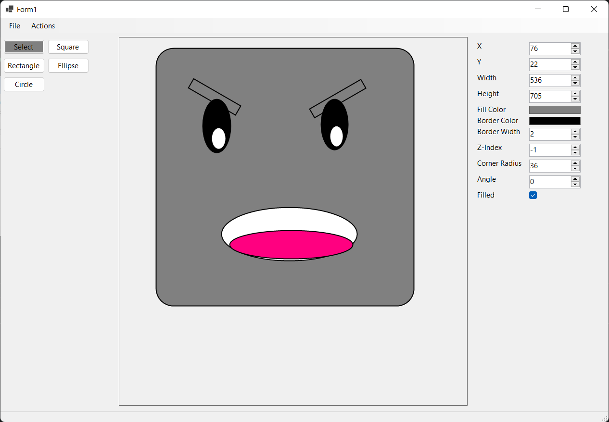
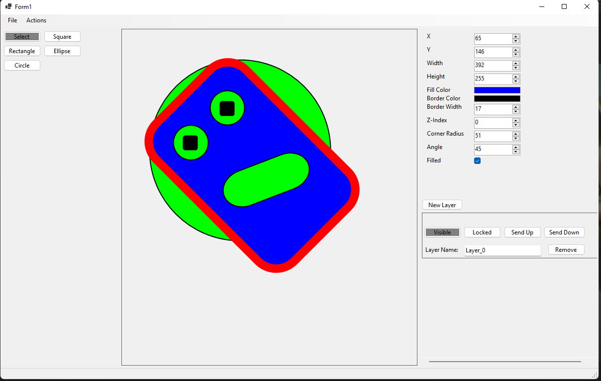
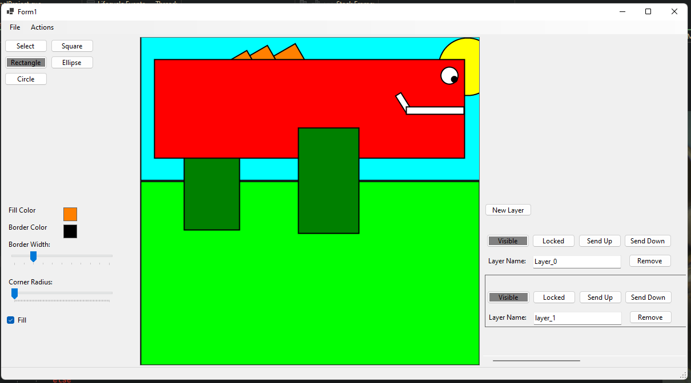

# SVG Editor
This is a simple program to create simple svg images. It supports:
  - Different shapes (Rectangle, Square, Ellipse, Cricle)
  - Colors
  - Rounded Corners
  - Rotating Shapes
  - Editting Shapes
  - The ability to use layers
  - Saving a project
  - Exporting project to and SVG file
  - Selection (hold shift to select multiple shapes)

# How to use
You can get an executable from the Releases page. Open the app and dragging with your mouse to draw a shape. You can select the kinda of shape with the buttons on the left. If you use the Select mode, you can select a shape but clicking on it, and hold shift to select multiple shapes. When you have a shape selected you can change its properties on the panel on the right. You can also draw on multiple layers, make each layer visible or locked, and move the layers about. You can also save your work to keep on working another time, or export you image into a .svg file.

 

 

# Libraries Used
This was done using C# and Windows Forms. This project would not have been possible without the helpe of <a href="https://github.com/svg-net/SVG">SVG .NET</a>,
a powerful but simple library to handle svg graphics in C#. This other project: <a href="https://github.com/cdiggins/svg-editor">https://github.com/cdiggins/svg-editor</a> has been very useful as a skeleton and inspiration for the basic features of this program, it is also worth checking out!

# Bugs
  - There might be bugs with the undo/redo systems ever since I've added the layers system, making these work together was difficult.
  - Some informations in the shape properties box does not always represent the desired values, sometimes some are not updated properly, for example the square and circle, the information might look weird (unequal sides even they are drawn equally). 
  
# Todo
  - Responsive UI, right now the UI is pretty static
  - Tooltips
  - Some refactoring
  - Putting icons in the buttons instead of text, that would make the app look much cleaner
  - Add poligons and lines to give more freedom
